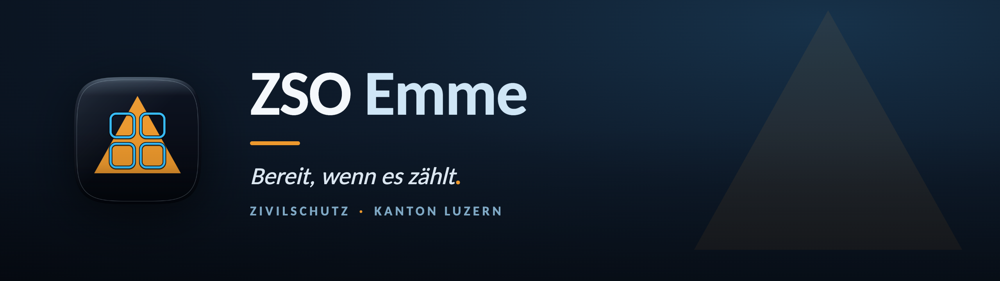

  

## ZSO Emme

Zivilschutzorganisation Emme — Zivilschutz im Kanton Luzern. Eine von drei ZSO im Kanton.

### Digitale Einsatz- und Führungsunterstützung

Eigenentwickelte, integrierte Software-Umgebung für die Milizarbeit: eine gemeinsame Plattform mit zentraler Anmeldung, aus der sich alle Anwendungen öffnen — durchgängig und offline-fähig.

### Was die Plattform abdeckt

**Führung & Einsatz** — von der Alarmierung und dem Aufgebot über Präsenz und Eintrittsbefragung bis zur elektronischen Lagedarstellung, Auftrags- und Fahrzeugdisposition sowie der strukturierten Lageverarbeitung und Entschlussfassung.

**Ressourcen & Logistik** — Bewirtschaftung und Wartung von Material und Schutzanlagen, Verpflegung sowie spezialisierte Mittel wie Drohnen und der Schutz von Kulturgütern.

**Sicherheit & Nachbearbeitung** — Sicherheitskonzepte je Einsatz, Rapport- und Protokollwesen, Berichterstattung und Controlling sowie die Betreuung der Bevölkerung.

**Personal & Administration** — Kaderausbildung und Anwärter, Dienstverschiebungen, Anlass- und Teilnehmerverwaltung, persönliche Stammdaten und eine zentrale Wissensbasis.

> Die Quellrepositories sind aus Sicherheits- und Datenschutzgründen privat.

---

🌐 [zsoemme.ch](https://www.zsoemme.ch) · ✉️ [info@zsoemme.ch](mailto:info@zsoemme.ch) · 📍 Kanton Luzern, Schweiz
